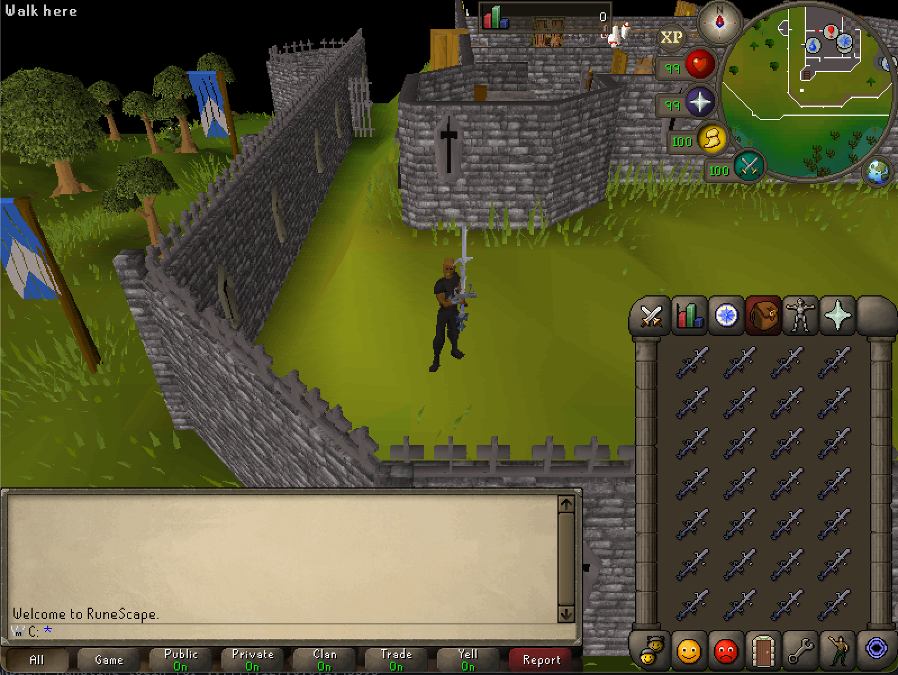
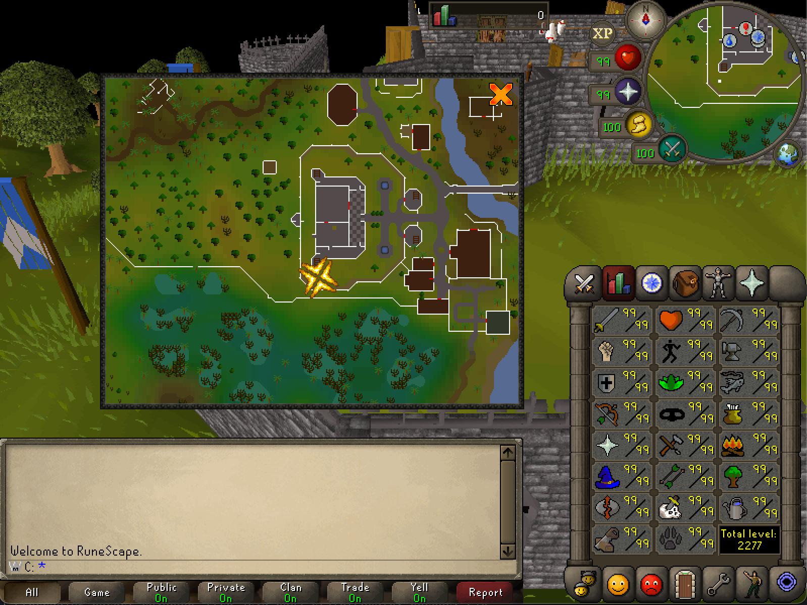

# TSPS - TypeScript Private Server

This is an implementation of a RuneScape 317 revision written completely in TypeScript. 

Due to development being done towards the Elvarg client, this might not work with any other 317 clients - as Elvarg changes a few things.

## THIS IS STILL VERY, VERY EARLY WIP

### Screenshots

